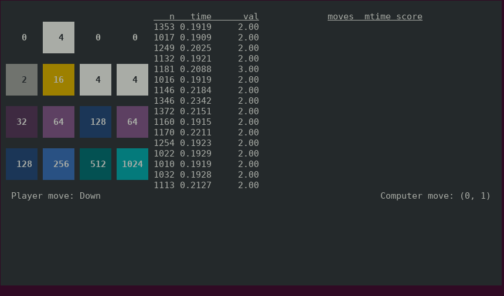

# Autonomous 2048 Solver

A 2048 artificial intelligence solver built using _adversarial
expectimax search_, with a curses interface.

## Features

- Allows user to select one of several autonomous agents to play a
  series of games of 2048.
- Displays a color-coded game-board and real-time evaluation data in a
  windowed console-based interface.
- Updates long-run performance after every game.
- Calculates confidence intervals based on variance of observed trials.
- Default agent successfully reaches 2048 in over 50% of trials with a
  time limit of .2 seconds per move.



## Requirements

- Python3 (tested on 3.9 and above)
- curses (included with Mac and Linux, but requires additional install
  on Windows)
- numpy
- Runs in a terminal, preferably with color support

## Installation and Usage

The following instructions are for Mac and Linux systems.

1. Open a terminal and select a location to download the git repo:

```
    cd [preferred code folder]
    git clone https://github.com/morganwl/2048-solver
    cd 2048-solver
```

2. Creating a _virtual environment_ is highly recommended::

```
    python3 -m venv venv
    source venv/bin/activate.sh
```

3. Install the package, which will install the required dependencies::

```
    pip python
```

4. Watch your computer play 2048::

```
    play.py
```

For more command line options, run:

```
    play.py --help
```

## The game of 2048

The game of 2048 presents the player with numeric tiles placed on a 4x4
board. By sliding the tiles in one of four directions (right, left, up
and down), the player can combine tiles of the same value into a new,
larger tile. After each player move, a single tile is added in one of
the empty spaces. The placement of the new tile is uniformly random, but
the value is 2 with a 90% probability and 4 with 10% probability.

The original game can be (played
online)[https://https://play2048.co/], and the source code is on Github
as (gabrielecirulli/2048)[https://github.com/gabrielecirulli/2048].

The game is _won_ by achieving a tile of at least 2048, though play
continues afterwards and larger tiles are possible.

## 2048 as an Artificial Intelligence Problem

Because the actions, outcomes, and goals are well-defined, 2048 presents
an interesting _toy_ problem for AI agents. An autonomous agent can
play by considering the outcome of each possible move, and selecting the
move with the best outcome. However, because a single game can span over
a thousand turns, with each turn containing many possible outcomes, the
state space is too large to be searched quickly. A successful agent must
utilize a mixture of pruning techniques and heuristic evaluation
functions to estimate the best outcome after a short sequence of moves.

### Adversarial Search

The central algorithm for this project is _adversarial expectimax
search_. The search is split into three phases, each of which determines
the value of a particular state by different rules.

- **Player phase (max)**: The player will choose the move with the
  highest expected value. As such, the value of a Max state is directly
  proportional to the highest value of possible moves from that state.
- **Opponent phase (min)**: The opponent is _assumed_ to choose the
  optimal move, which is the move with the _lowest_ expected value.
  Therefore, the value of a Min state is directly proportional to the
  lowest value of possible moves from that state.
- **Environmental phase (expect)**: In a non-deterministic environment,
  an action might have more than one possible outcome. The expected
  value of a particular move is the value of each state that might
  result, multiplied by the probability of that state. In our search
  algorithm, we treat the _value_ of the newly inserted tile to be
  non-deterministic.

Ideally, a search algorithm would be able to follow each move to the end
of the game, assessing the value of any given move based on the values
of _leaf states_. However, searching a tree that might be thousands of
levels deep, with a branching factor of anywhere from 2 to 120 outcomes
per turn, is intractable.

We compromise with a depth-limited search, which evaluates all states of
a certain depth and propagates that value back up the tree. Choosing the
appropriate depth, and the appropriate evaluation function, is part of
the challenge.

## Gameplay Interface

A session can be started from the command line by running the script
'play.py'. This will play a series of games, displaying statistics over
the course of the session. Proper display requires the _curses_ library,
which is installed on all Linux and MacOS systems, but might not be
present on a Windows system.

### Board window

The game board is shown in the top left. Tiles are color coded by value.

### Move log

The move log is shown in the top center. Each move reports the number of
game states explored, the total search time for that move, and the
estimated value of the selected move.

### Game log

The game log is shown in the top right. Each game reports the total
number of moves made, the average search time for each move, and the
final score.

### Console

Logging information is printed to the console, at the bottom of the
screen. Currently, the console prints estimated score distributions and
an estimated median score after the completion of each game. Score
distributions are reported as the percentage of games achieving a
certain score or higher, with their 95% confidence intervals. The median
is reported with the confidence that this is the exact median score.

#### Confidence Intervals

Confidence intervals are calculated by bootstrapping, i.e. repeatedly
sampling the recorded games, with repetition. Because this repeated
sampling is only meaningful with a sufficiently large number of played
games to sample from, confidence intervals calculated after only a few
games are not likely to be accurate.

One solution is warming up the bootstrap with a number of samples before
reporting any confidence intervals, to ensure a sufficiently large
sample size. Because this is a rather time-consuming process for an
interactive tool, I have chosen an alternative solution --- before
calculating confidence intervals, a number of randomly generated games
are added to the sample space, with a uniform distribution. As the
number of played games grows beyond the noise, the confidence intervals
will start to converge around the tighter distribution of those samples.

#### Why curses?

Windowed terminal applications can seem an anachronism in an era of
graphical interfaces. I chose curses for two reasons. The first was
practical: I still do a great deal of work and testing via ssh. A
curses interface will work on my laptop, my desktop, or via remote
session from my iPad to a Raspberry Pi. The second is purely nostalgia,
for a time when I ran my computer primarily in terminal mode, and played
text-based curses games such as _nethack_. I was curious to explore the
ways in which such interfaces were created.

## Issues

### Game runner

- Needs usage instructions
- Needs on-screen help re: kbd shortcuts
- Tweak agent configuration from command line
- Would be great to have interactive option selection, switch options
  within one session
- Curses implementation is kludgy
- Needs improved error logging

### Agent

- Agents need to be organized into separate files for clarity and
  simplicity

### Testing

- Very few tests have been written

### Documentation

- Readme needs more detailed description of game, with references
- Readme needs more detailed description of agent implementations, with
  evaluation
